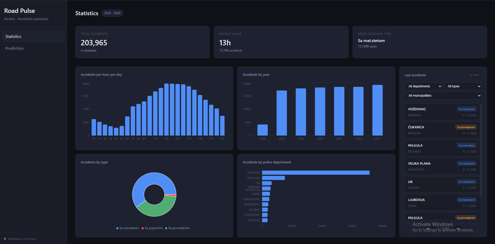
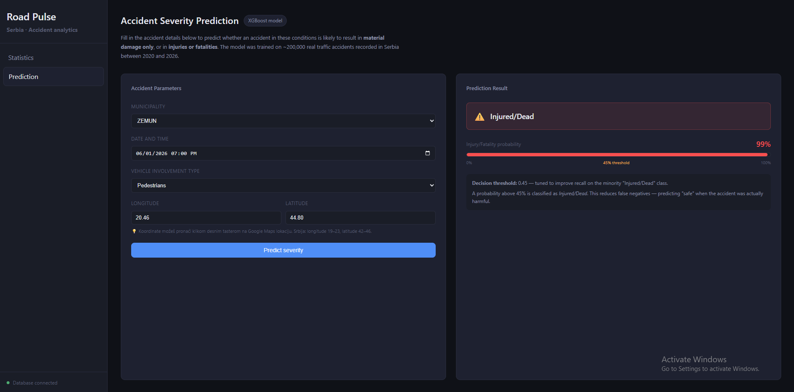
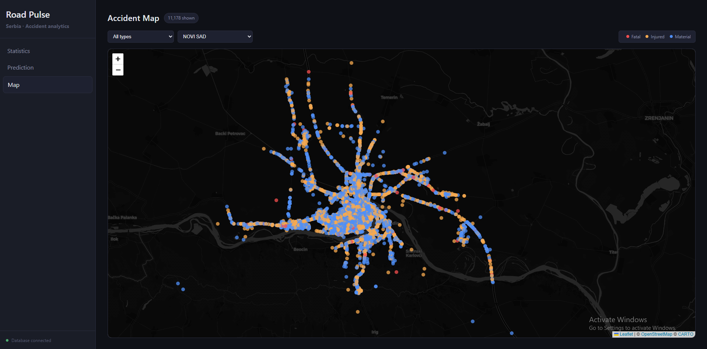

# Road Pulse - Serbia Traffic Accident Analytics

A full-stack analytics platform built on **~205,000 real traffic accidents** recorded in Serbia between 2020 and 2026, sourced from [data.gov.rs](https://data.gov.rs). The project covers the entire data science pipeline - data ingestion, exploratory analysis, feature engineering, model training and evaluation, API development and React dashboard.

---

## Screenshots


*Interactive dashboard with accident statistics and KPIs*


*ML-powered severity prediction form*


*Geospatial visualization of accident hotspots across Serbia*

---

## What This Project Does

### 1. Statistics Dashboard
A live dashboard that visualizes the full accident dataset:
- Accidents by **hour of day**, **year**, **police department**, and **accident type**
- Filterable accident feed with pagination (by department, type, municipality)
- Summary KPIs: total accidents, busiest hour, most common type


### 2. Accident Map

An interactive map of Serbia showing individual accident locations as color-coded pins:
- **Red** — fatal accidents (Sa poginulim)
- **Orange** — accidents with injuries (Sa povredjenim)
- **Blue** — material damage only (Sa mat. štetom)
- Filterable by accident type and municipality
- Click any pin to see location, type, and timestamp

### 3. Severity Predictor

A machine learning form that answers: *"Given these accident conditions — would this likely result in injuries, or just material damage?"*
 
The user selects a municipality, date/time, and vehicle involvement type. The backend runs the input through the trained XGBoost model and returns a prediction with probability score.
  
---

## Architecture

```
road-pulse/
├── backend/
│   └── app/
│       ├── api/            ← FastAPI route handlers
│       ├── models/         ← SQLAlchemy ORM models
│       ├── schemas/        ← Pydantic request/response schemas
│       ├── services/       ← Business logic (DB queries, ML prediction)
│       ├── scripts/        ← Data preprocessing pipeline
│       └── db/             ← Database engine and session factory
├── frontend/
│   └── src/
│       ├── pages/          ← StatsPage, PredictPage
│       ├── components/     ← Charts, AccidentsFeed, Layout
│       └── api/            ← fetch() wrappers for all endpoints
├── models/
│   ├── xgboost_tuned.pkl   ← Trained model (not in git, see below)
│   └── encoders/           ← TargetEncoder objects for municipality & description
├── notebooks/              ← EDA, Feature Engineering, Model Training notebooks
├── data/
│   ├── raw/                ← Original xlsx files (not in git)
│   └── processed/          ← Cleaned dataset (not in git)
├── docker-compose.yml
└── Dockerfile
```

---

## Tech Stack

| Layer | Technology |
|---|---|
| Data source | data.gov.rs (xlsx, 2020–2026) |
| Database | PostgreSQL 15 |
| ORM | SQLAlchemy 2.0 |
| Backend | FastAPI + Uvicorn |
| ML | XGBoost, Scikit-learn, category_encoders |
| Feature engineering | Pandas, NumPy |
| Frontend | React 19 + Vite |
| Charts | Recharts |
| Maps | Leaflet / React-Leaflet |
| Routing | React Router v7 |
| Infrastructure | Docker + Docker Compose |

---

## Machine Learning

### Problem

Binary classification: predict whether a traffic accident will result in **injuries or fatalities** (class 1) vs. **material damage only** (class 0).

### Dataset

~205,000 accidents. Class distribution: ~60% material damage, ~40% injured/dead.

### Data Quality Issues Found in EDA

- **No missing values** in the raw dataset.
- **Duplicate rows** were present — different accident IDs but identical data, likely from multiple reports of the same incident. Removed via deduplication on `accident_id`.
- **Malformed coordinates** — ~32,125 rows (~16% of data) had longitude/latitude recorded without a decimal point due to a data entry error. These were detected and corrected before modeling.

### Features Used

| Feature | Description |
|---|---|
| `municipality` | TargetEncoder — municipality mapped to its mean injury rate |
| `longitude` | Geographic longitude coordinate |
| `latitude` | Geographic latitude coordinate |
| `month` | Month of year (1–12) |
| `day_of_week` | Day of week (0=Monday, 6=Sunday) |
| `hour` | Hour of day (0–23) |
| `day_type` | Weekend vs. weekday (binary) |
| `is_rush` | Rush hour flag (7-9am or 4-7pm on weekdays) |
| `is_night` | Nighttime flag (22:00-05:00) |
| `season` | Season of year (Winter, Spring, Summer, Autumn) |
| `acc_single_vehicle` | One-hot: single vehicle involved |
| `acc_two_vehicles_no_turn` | One-hot: two vehicles, no turn |
| `acc_two_vehicles_turn_or_cross` | One-hot: two vehicles, turn or crossing |
| `acc_parked_vehicles` | One-hot: parked vehicle involved |
| `acc_pedestrians` | One-hot: pedestrian involved |

### Data Preprocessing Pipeline

The preprocessing pipeline (`scripts/preprocess.py`) handles:
- Datetime feature extraction (hour, month, day_of_week, season)
- Temporal feature engineering (rush hour, night time, day type)
- Vehicle involvement one-hot encoding

### Models Evaluated

Five configurations were trained and compared in `notebooks/model_comparison.ipynb`:
 
| Model | Accuracy | F1 (Material) | F1 (Injured/Dead) | F1 (Macro) | AUC-ROC |
|---|---|---|---|---|---|
| **XGBoost (Tuned)** | ~0.73 | ~0.79 | ~0.64 | ~0.72 | **0.8031** |
| Random Forest (Tuned) | ~0.73 | ~0.79 | ~0.64 | ~0.72 | 0.8027 |
| XGBoost (Baseline) | ~0.72 | ~0.78 | ~0.63 | ~0.71 | ~0.80 |
| Logistic Regression (Baseline) | ~0.70 | ~0.76 | ~0.61 | ~0.69 | ~0.79 |
| Random Forest (Default) | — | — | — | — | < baseline |
 
**XGBoost (Tuned)** was selected for the lowest false negative rate on the "Injured/Dead" class. The decision threshold was lowered from 0.5 to **0.45** to further improve recall — in a safety context, predicting "safe" when an accident was actually harmful is the costlier mistake.
 
All tuned models converge around AUC ~0.80, suggesting the current feature set has reached its informational ceiling. Further improvement would likely require additional data not present in administrative records (vehicle speed, road conditions, driver state).

---
 
## Key Findings from EDA
 
- **Rush hour effect:** Accidents peak sharply at **17h** (end of work day), with a secondary morning peak at **8h**.
- **Weekday vs. weekend:** More accidents occur on weekdays in absolute terms, but the hourly distribution shifts on weekends — accidents spread more evenly across the day without the rush-hour spike.
- **Seasonal pattern:** Summer months (June–August) show elevated accident counts, likely due to increased road activity and longer daylight hours.
- **Type distribution:** ~60% of accidents result in material damage only; ~40% involve injuries or fatalities.
- **Pedestrian accidents** have the highest injury rate of all vehicle involvement categories.
- **Coordinate data quality:** ~16% of coordinate records were malformed (missing decimal point), requiring correction before any geographic analysis or modeling.

---

## Running Locally

### Prerequisites
- Docker + Docker Compose
- Node.js 20+
- Python 3.13+ (only if running outside Docker)

### Step 1 — Clone and configure environment

```bash
git clone https://github.com/YOUR_USERNAME/road-pulse.git
cd road-pulse
cp .env.example .env
# Edit .env and set your DB_USER, DB_PASSWORD, DB_NAME, DATABASE_URL
```

### Step 2 — Add the data files

Download the accident datasets from [data.gov.rs](https://data.gov.rs/sr/datasets/podatsi-o-saobratshajnim-nezgodama-po-politsijskim-upravama-i-opshtinama/) and place them in `data/raw/`:

```
data/raw/nez-opendata-2020.xlsx
data/raw/nez-opendata-2021.xlsx
...
data/raw/nez-opendata-2026.xlsx
```

### Step 3 — Start the database

```bash
docker compose up db -d
```

### Step 4 — Import data into the database

```bash
# Install Python dependencies
pip install -r requirements-api.txt

# Run the import script
python -m backend.app.scripts.import_data
```

### Step 5 — Add the trained model

Place your trained model and encoders in the `models/` directory:

```
models/
├── xgboost_tuned.pkl
└── encoders/
    └── xgb_mun_target_encoder.pkl
```

> **Note:** Model files are not included in this repository due to size. You can retrain them by running the notebooks in `notebooks/` in order: `EDA.ipynb` → `feature_engineering.ipynb` → `modeling.ipynb`.

### Step 6 — Start the backend

```bash
# Option A: locally
uvicorn backend.app.main:app --reload --port 8000

# Option B: via Docker (starts both db and backend)
docker compose up --build
```

Backend is available at: `http://localhost:8000`
API documentation (Swagger UI): `http://localhost:8000/docs`

### Step 7 — Start the frontend

```bash
cd frontend
npm install
npm run dev
```

Frontend is available at: `http://localhost:5173`

---

## API Endpoints

| Method | Endpoint | Description |
|---|---|---|
| GET | `/health` | Health check — confirms DB connection |
| GET | `/api/v1/accidents` | Paginated accident list with filters |
| GET | `/api/v1/accidents/{id}` | Single accident by ID |
| GET | `/api/v1/accidents/statistics/department` | Counts by police department |
| GET | `/api/v1/accidents/statistics/municipality` | Counts by municipality |
| GET | `/api/v1/accidents/statistics/year` | Counts by year |
| GET | `/api/v1/accidents/statistics/hour` | Counts by hour of day |
| GET | `/api/v1/accidents/statistics/type` | Counts by accident type |
| GET | `/api/v1/accidents/map` | All accidents with coordinates (for map visualization) |
| POST | `/api/v1/predict` | Severity prediction from accident parameters |

### Example: Predict severity

```bash
curl -X POST http://localhost:8000/api/v1/predict \
  -H "Content-Type: application/json" \
  -d '{
    "municipality": "NIŠ",
    "date_time": "2024-03-15T17:30:00",
    "involved_vehicles_num": "SN SA NAJMANjE DVA VOZILA – BEZ SKRETANjA",
    "longitude": 21.8958,
    "latitude": 43.3209
  }'
```

Response:
```json
{
  "severity": "Injured/Dead",
  "probability": 0.6134
}
```

---

## Data Source

All data is sourced from the official Serbian open data portal:  [data.gov.rs - Saobraćajne nesreće](https://data.gov.rs/sr/datasets/podatsi-o-saobratshajnim-nezgodama-po-politsijskim-upravama-i-opshtinama/)

---

## Author 

**Github:** [github.com/sav0sav1c5/](https://github.com/sav0sav1c5)

Built as a portfolio project to demonstrate end-to-end data science and full-stack development skills.

**Technologies demonstrated:** Data engineering (ETL pipelines), Machine Learning (XGBoost, feature engineering), Backend development (FastAPI, PostgreSQL), Frontend development (React, Leaflet maps), DevOps (Docker, deployment ready).